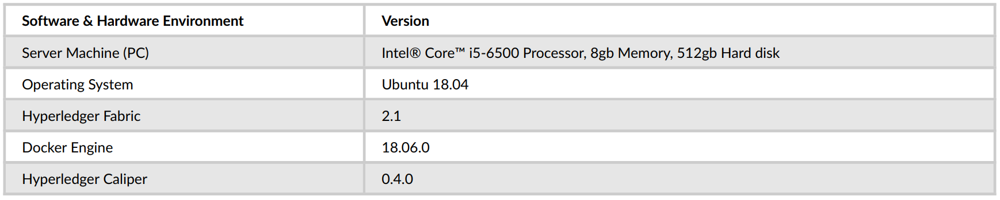

# On the adoption of Blockchain for IoT devices in Supply-chain
### Abstract
The integration of the blockchain and IoT solves a number of issues of centralized IoT networks as it provides an environment based on decentralization, fault tolerance, enhanced security, and transparency for the data of the IoT devices. The blockchain needs the consensus between the network nodes to agree on the single state of the ledger data. However, the extensive computational requirements for the consensus algorithms in blockchain are not in any way suitable for resource-constrained IoT devices with limited computational and communications capabilities. To address this issue, this study proposes a modified version of the Raft consensus protocol for use in IoT devices based on the permissioned blockchain Hyperledger Fabric. Each transaction in Raft consensus protocol is directed to the leader node, that transmits it to the follower nodes, making the leader node the bottleneck thus inhibiting the scalability and throughput of the system. This also results in high latency for the network. The modified RAFT consensus protocol (m-RAFT) is based on the idea of utilizing the idle follower nodes in disseminating the vote requests and log replication messages. A detailed experimental evaluation of the solution built on Hyperledger is done using Hyperledger Caliper to demonstrate the effectiveness of the system. The balanced workload division on the peers improves the throughput and latency of the protocol in ordering service that increases the overall efficiency of the system.

### Software and Hardware Environment
The system build and test environment are implemented using Linux virtual machine services. The Hyperledger Fabric network is built, run, and tested using the Raft and mRAFT consensus protocol. The environmental parameters for software and hardware are shown in table given below. The prototype solution for experimental evaluation and testing is based on a virtual server hosted on a laptop computing machine with limited computational resources and capabilities. It must be kept in mind that in the production environment, the blockchain nodes will be held on server machines with heavy computational capabilities whose performance could differ in terms of scale. However, the rationale behind the results would be the same.

